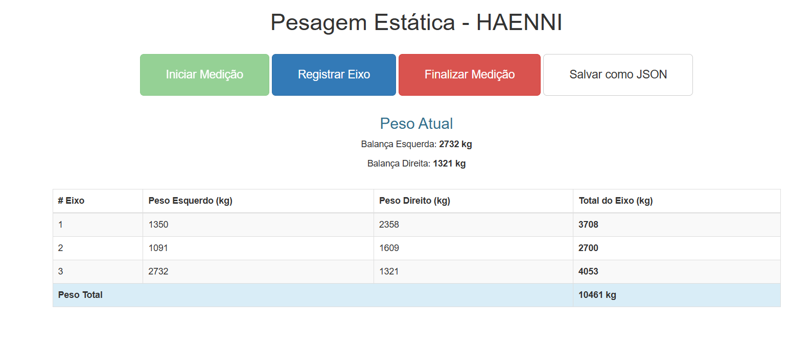

# 🛻 Simulador de Balança Estática 
🎯 Simule a pesagem de eixos de veículos pesados com precisão e praticidade!

Este projeto oferece uma interface interativa desenvolvida com **Vue.js** e **Bootstrap**, permitindo a simulação de registros de peso em balanças estáticas (esquerda e direita), totalizando os pesos de forma eficiente.




---

## ⚙️ Funcionalidades

- 🟢 **Iniciar Medição**: Comece uma nova sessão de pesagem.
- 🔴 **Finalizar Medição**: Encerre a sessão atual e registre os dados.
- ⚖️ **Simulação de Pesos**: Ajuste os valores das balanças esquerda e direita para simular diferentes cargas.
- 📝 **Registro de Eixos**: Registre os pesos simulados de cada eixo do veículo.
- 📤 **Exportação de Dados**: Exporte os registros em formato JSON para análise ou armazenamento.

---

## 🚀 Como Executar

1. Clone ou faça o download deste repositório:
   ```bash
   git clone https://github.com/gilsonfiho/Static-Truck-Scale-Simulator.git
   ```
2. Abra o arquivo `index.html` em qualquer navegador moderno (Chrome, Firefox, Edge, etc).
3. A interface estará pronta para uso, sem necessidade de instalações adicionais.

---

## 📂 Estrutura do Projeto

```
Static-Truck-Scale-Simulator/
├── css/
│   └── [Arquivos de estilo]
├── js/
│   └── [Scripts JavaScript]
├── index.html
├── LICENSE
└── README.md
```

---

## 🧪 Tecnologias Utilizadas

- [Vue.js](https://vuejs.org/)
- [Bootstrap](https://getbootstrap.com/)
- HTML5 & CSS3
- JavaScript

---

## 📄 Licença

Este projeto está licenciado sob a [Licença MIT](LICENSE).

---

## 📬 Contato

Para dúvidas, sugestões ou colaborações:

- GitHub: [@gilsonfiho](https://github.com/gilsonfiho)
- Email: gilson405719@hotmail.com
- Linkedin: https://www.linkedin.com/in/gilson-almeida-608b62178
---

